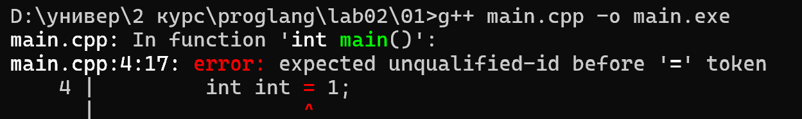
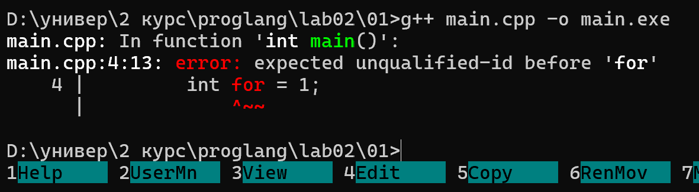
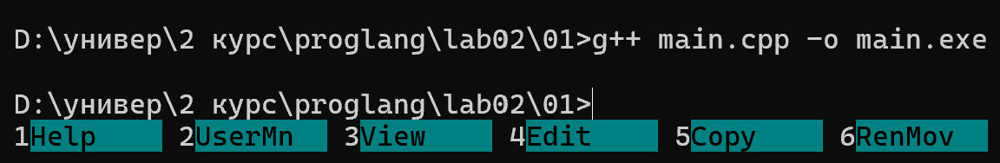
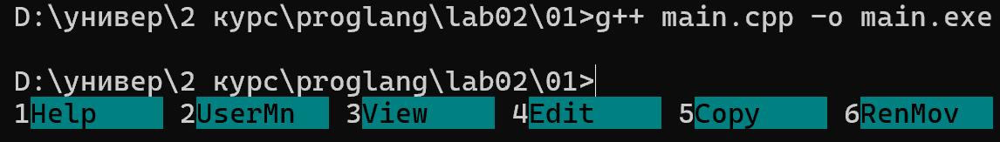
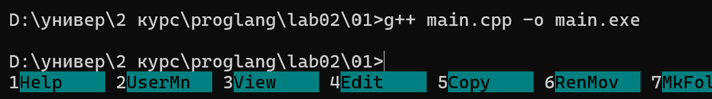
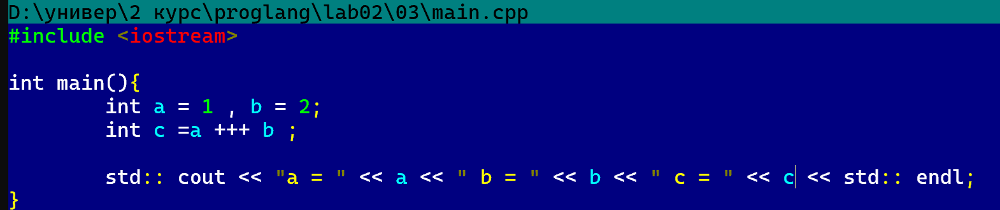
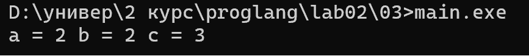
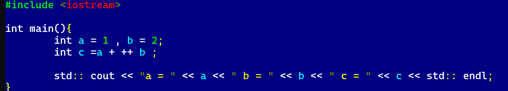
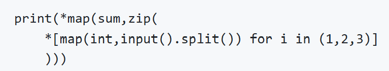
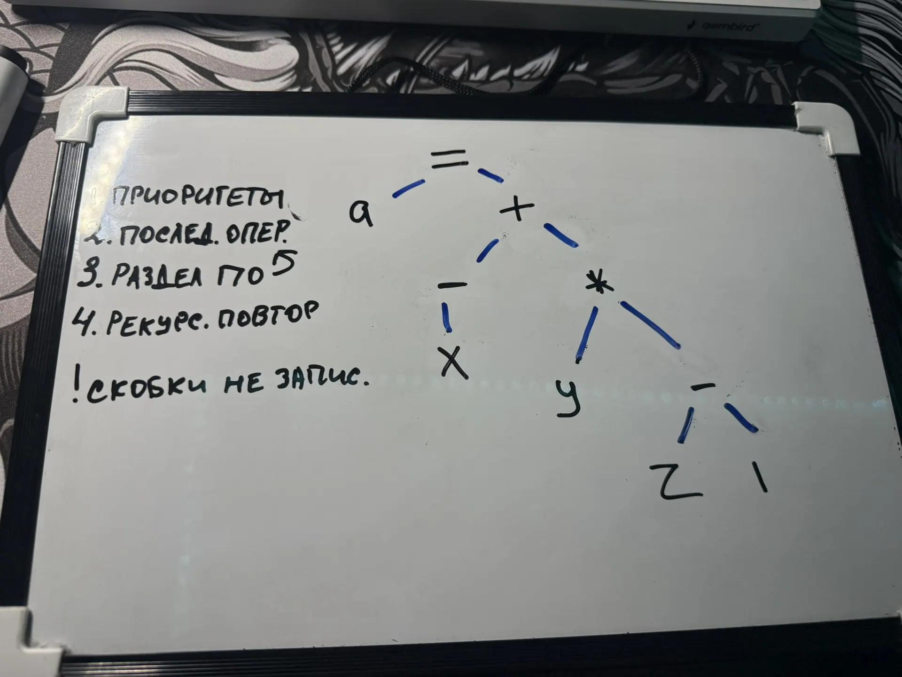

# лабараторная работа 02

### 01

На С++ попробую создать переменные с именами int, cin, for, include, std

переменную int и for создать нельзя

на python поробую создать переменные с именами int, import, def, try, for

все кроме int нельзя создать(строго зарезервированы)

на java попробую создать переменные с именами int, public, for, new, final

все нельзя создать

### 02

c++
int a =1 , b =2;
int c =a ++ b;

Последовательность теконов: int a = 1 , b = 2 ; int c = a ++ b ;

программа содержит ошибку так как в с++ ++ является унарным оператором и не разбивается 

python
a =1
b =2
c=a ++ b

последовательность токенов: a = 1  b = 2 c = a + + b

программа не содержит ошибку так как в python ++ разбивается на + +  (сложение и унарный плюс)

### 03

рассмотрим с++ программу

токены: 

Заголовок функции: int, main, (, ), {

Первая строка: int, a, =, 1, ,, b, =, 2, ;

Вторая строка: int, c, =, a, ++, +, b, ;

Вывод в консоль: std, ::, cout, <<, "a = ", <<, a, <<, " b = ", <<, b, <<, " c = ", <<, c, <<, std, ::, endl, ;

Закрывающая скобка: }

результат программы:

добавив один пробел изменили разбиение на токены => изменили результат программы

### 04
скобки после имени - операторы

квадратные для индексации - операторы

точка - оператор

### 05

Рассмотрим следующую программу на языке Python

Ключевые слова: for, in.

Идентификаторы (Identifiers): print, map, sum, zip, int, input, split, i.

Литералы (Literals): кортеж целых чисел (1, 2, 3).

Числа 1, 2, 3 внутри него — целочисленные литералы.

Операторы :Звёздочка распаковки * (используется дважды: перед map и перед списковым включением [...]).

Синтаксические знаки и разделители: круглые скобки (), квадратные скобки [], точка . (доступ к методу), запятая ,.

Идентификаторы, задающие переменные:i — переменная цикла (счётчик в генераторе списка).

Идентификаторы, задающие имена функций и методов: print, map, sum, zip, int, input — имена встроенных функций 
Python.split — имя метода строковых объектов.

### 06

Как можно записывать комментарии на С++?

Какие из приведенных ниже примеров являются синтаксически неверными (вызывают ошибки при трансляции)? Почему? Как работают синтаксически верные примеры?

`cout<<"Hello /* Это комментарий */ world";        | /* и */ находятся внутри двойных кавычек строкового литерала. ошибки нет

`// /*                                             |
` Это комментарий                                  | Первая строка начинается с //, поэтому вся эта строка  полностью игнорируется компилятором.
`*/                                                |

`/* Я комментирую программы /* комментарий */ */   | В C++ многострочные комментарии не могут быть вложенными.

`// Я комментирую программы /* комментарий */      |  Строка начинается с //, поэтому абсолютно всё, что написано после этих символов до самого конца строки считается однострочным комментарием и игнорируется компилятором.

`/* Я комментирую свои программы                   |  Символы // находятся внутри многострочного комментария /* ... */. Компилятор, находясь внутри многострочного комментария, просто ищет символ закрытия */ и не обращает внимания на //
`// Это комментарий до конца строки */             |
`*/                                                |

### 07

Как видно из правил, есть 4 инструкции циклов.
Первый вид — цикл while, который соответствует строке правила:
	while ( condition ) statement
Формат записи (по правилу): ключевое слово «while», в круглых скобках условие «condition», далее — инструкция «statement» (тело цикла), которая выполняется, пока условие истинно.

`int x = 1;
`while (x < 1000) {
`    cout << x;
`    x *= 2;
`}

Второй вид — цикл do-while, который соответствует строке правила:
	do statement while (expression);

Формат записи (по правилу): ключевое слово «do», далее инструкция «statement» (тело цикла), затем ключевое слово «while», в круглых скобках выражение «expression», и обязательная точка с запятой в конце. Особенность: тело цикла выполняется хотя бы один раз, так как условие проверяется после его выполнения.

`int x = 1;
`do {
`    cout << x;
`    x *= 2;
`} while (x < 1000);

Третий вид — цикл for (классический), который соответствует строке правила:
	for ( init-statement conditionopt ; expressionopt ) statement

Формат записи (по правилу): ключевое слово «for», далее в круглых скобках — инструкция инициализации «init-statement» (она уже сама содержит завершающую точку с запятой, например объявление счётчика), затем необязательное (индекс opt означает «опционально») условие «condition», точка с запятой, затем необязательное выражение «expression» (обычно меняет счётчик), закрывающая скобка, и далее — инструкция «statement» (тело цикла).

`for (int i = 0; i < 10; i++) {
`    cout << i;
`}

Четвёртый вид — цикл for по диапазону (range-based for), который соответствует строке правила:
for ( for-range-declaration : for-range-initializer ) statement

Формат записи (по правилу): ключевое слово «for», в круглых скобках — объявление переменной цикла «for-range-declaration» (тип и имя переменной, в которую на каждой итерации попадает очередной элемент), двоеточие, инициализатор диапазона «for-range-initializer» (контейнер или последовательность, по которой идёт перебор), закрывающая скобка, далее — инструкция «statement» (тело цикла).

`vector<int> v = {1, 2, 3, 4, 5};
`for (int x : v) {
`    cout << x;
`}

### 08

