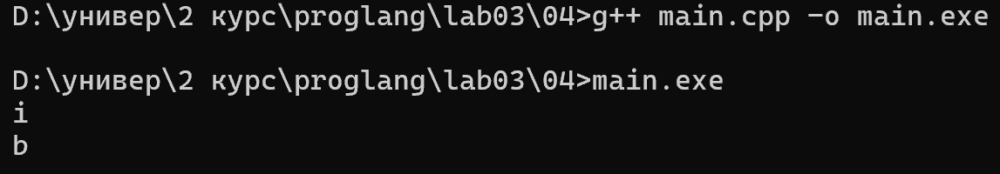
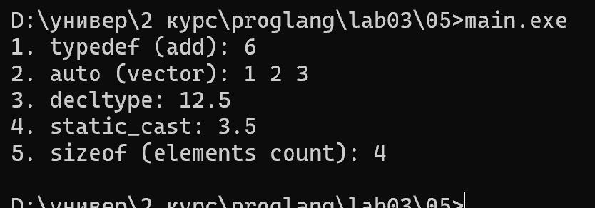
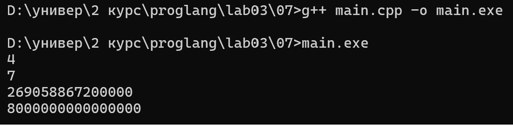

# Языки программирования

## Лабораторная работа 3

### Задание 1 (3)

глоссарий определений

* Тип - атрибут объекта данных, задающий множество допустимых
значений и методы для работы с ними.

* Статическая типизация: Язык программирования обладает статической типизацией, если
тип объекта данных определяется в момент трансляции.

* Динамическая типизация: Язык программирования обладает динамической типизацией, если
тип объекта данных определяется на этапе выполнения программы в
момент создания или присваивания значения.

* Неявная типизация

* Явное преобразование типа: Преобразование типа называется явным, если оно указано в
программе в виде вызова функции или в виде операции.

* Неявное преобразование типа: Преобразование типа называется неявным, если оно не
присутствует в программе в виде конкретного указания, однако
транслятор сам подставляет требуемый метод преобразования.

* Сильная типизация — язык программирования не содержит (почти
не содержит) правил неявного преобразования типа.

* Каламбуром типизации называется ситуация, когда одна ячейка
данных рассматривается как две переменные разных типов.

* Слабая типизация — язык программирования содержит большое
число правил неявного преобразования типа, допускает каламбуры
типизации.

### Задание 2 (3)

Запишите правила неявного преобразования типов в языке С++

Проверка отчета будет включать проверку знания правил.

* Преобразование с символьными типами: по коду символа.

* При вызове функции фактический параметр приводится к типу
формального параметра.

* Если оператор требует целого числа то операнд приводится к
целому (суффиксный инкремент, декремент, сдвиги, остатки от
деления, битовые операции).

Преобразования при присваивании

* При присваивании значение правого операнда приводится к типу
левого операнда. 

Преобразования при арифметических действиях: 

* Если длины обоих типов меньше int то преобразование к int

* Если типы разной длины, то преобразуется меньший к большему

* Если типы равной длины и один знаковый, а другой беззнаковый,
то знаковый приводится к беззнаковому.

* Если один целый, а другой вещественный, то целый приводится к
вещественному.

* Преобразование из вещественных в целочисленные: отсечение
дробной части.

Преобразования с логическими значениями

* Если оператор требует логического значения, то операнды
приводятся к логическому типу

* Преобразование в bool: 0 — false; остальные значения — true.

* Преобразование из bool: false — 0; true — 1.

* 

### Задание 3 (2)
Языки C++ и Java имеют похожий синтаксис, однако язык С++ относят к языкам со слабой статической типизацией, а Java - с сильной статической типизацией. Приведите примеры, показывающие это различие. Для этого вам надо подобрать несколько близких по смыслу фрагментов программ, которые будут транслироваться в С++, но вызывать ошибку согласования типов в Java.

Записанные программы сохраните в папке с номером задания. В отчет запишите пояснения к работе программ.

Рассмотрим пример 1 (01.cpp и 01.java)

В C++ числовое значение x автоматически интерпретируется как логическое условие. В Java выражение внутри if обязательно должно иметь тип boolean, поэтому компилятор Java выдает ошибку несогласования типов.

рассмотрим пример 2(02.cpp и  02.java)

В C++ происходит неявная потеря точности без предупреждения. Java защищает от случайной потери данных и отказывается компилировать код, требуя явного приведения типов: int i = (int) d;

### Задание 4 (1)

Рассмотрим следующий фрагмент программы.

`bool x = true, y = false;
auto a = x & y; 
std::cout << typeid(a).name() << std::endl;
auto b = x && y;                      
std::cout << typeid(b).name() << std::endl;`

выполнив программу получим:

Согласно стандарту C++, перед выполнением побитовых операций к операндам типа bool применяется правило продвижения типов. Значения bool расширяются до типа int (true становится 1, а false — 0).

Результат побитовой операции 1 & 0 равен 0 типа int.

Следовательно, ключевое слово auto выводит тип переменной a как int.

Оператор && — это логическое И

Логические операторы в C++ всегда возвращают значение типа boo

Выражение true && false дает результат false типа bool.

### Задание 5 (2)

Приведите разумные (логичные) примеры использования в С++ ключевых слов typedef, auto, decltype, static_cast и оператора sizeof.

результат программы

* typedef: Определен псевдоним MathOperation для указателей на математические функции. Это избавляет от громоздкой записи double (*)(double, double) при создании переменных и передаче функций в качестве параметров.

* auto: Компилятор автоматически выводит тип итератора std::vector<int>::iterator при обходе вектора в цикле, что делает код более компактным и защищенным от ошибок

* decltype: Ключевое слово определяет тип выражения a * b (который выводится в double из-за продвижения типов) и задает его переменной res без необходимости вручную прописывать тип.

* static_cast: Осуществляет явное приведение типа переменной sum из int в double перед делением. Это позволяет избежать выполнения целочисленного деления (7 / 2 = 3) и получить точный результат с плавающей точкой

* sizeof: Оператор запрашивает у компилятора общий размер массива в байтах (sizeof(arr)) и делит его на размер одного элемента (sizeof(arr[0])), благодаря чему корректно вычисляется количество элементов в статическом массиве.

### Задание 6 (2)

Рассмотрите следующий фрагмент программы.

`int a = -1, b = 1;
unsigned int c = 1;
std::cout << a * b << std::endl;
std::cout << a * c << std::endl;`

Объясните работу этой программы, используя правила неявного преобразования типов
Что произойдет, если тип int заменить на short, а unsigned int на unsigned short?*

типы операндов: int и int.

Правило: Оба операнда имеют одинаковый знаковый тип.

Результат: Выполняется обычное умножение signed-целых: -1 \cdot 1 = -1.

Вывод: -1

Вторая строка (a * c):

Типы операндов: int (a) и unsigned int (c).

Правило (Usual Arithmetic Conversions):
 
Если один из операндов имеет тип unsigned int, а второй — int (и оба имеют одинаковый ранг), операнд типа int неявно преобразуется к unsigned int.   

Преобразование: Число -1 типа int приводится к unsigned int по правилу дополнения до двух (добавляется 2^32 для 32-битного int). Это дает наибольшее возможное значение типа unsigned int: 4294967295.   

Результат: 4294967295 \cdot 1 = 4294967295.

Вывод: 4294967295

###Задание 7 (2)

Рассмотрим фрагмент программы:

`int x = 7, y = 4;                      
long double d = 0.25;                  
cout << (x / y) / d << endl;           
cout << (x / d) / y << endl;           
long a = 200000, b = 200000;           
long long c = 200000;                  
std::cout << (a * b) * c << std::endl; 
std::cout << a * (b * c) << std::endl; `

**Часть 1: int и long double**

Выражение `(x / y) / d`:
1. `x / y` — оба операнда `int`, поэтому деление целочисленное: 7 / 4 = 1 (дробная часть отбрасывается).
2. `1 / d` — `int` неявно преобразуется в `long double` (по правилу арифметических преобразований, к более «широкому» типу), 1 / 0.25 = 4.

Результат: **4**

Выражение `(x / d) / y`:
1. `x / d` — `int` преобразуется в `long double`, 7 / 0.25 = 28.
2. `28 / y` — `y` преобразуется в `long double`, 28 / 4 = 7.

Результат: **7**

Результаты разные, потому что в первом случае деление `x / y` выполняется над двумя `int` и теряет дробную часть до того, как в выражении появляется `long double`. Во втором случае `long double` появляется сразу, и вся дальнейшая арифметика идёт с плавающей точкой без потери точности.

**Часть 2: long и long long**

Выражение `(a * b) * c`:
1. `a * b` — оба операнда `long`, результат тоже `long`. Истинное значение 200000 · 200000 = 4 · 10^10.
2. Если `long` занимает 32 бита, максимум равен 2 147 483 647. Значение не помещается, происходит переполнение знакового типа.
3. Затем `long` неявно преобразуется в `long long` и умножается на `c`: 1 345 294 336 · 200000 = 269 058 867 200 000.

Результат (при 32-битном `long`): **269058867200000**

Выражение `a * (b * c)`:
1. `b * c` — `long` и `long long`, `b` неявно преобразуется в `long long`, результат `long long` = 4 · 10^10 (помещается).
2. `a * 40000000000` — `a` преобразуется в `long long`, результат 8 · 10^15.

Результат: **8000000000000000**

Результаты разные, потому что от порядка скобок зависит, в каком типе выполняется первое умножение. В первом случае это `long`, и он переполняется. Во втором первым вычисляется `b * c` уже в типе `long long`, и все дальнейшие вычисления идут в нём без потери значения.

### Задание 8 (2)
Для каких значений целочисленных переменных x, y ,z результатом вычисления следующего выражения будет истина? Перечислите все случаи. Объясните работу этой программы, используя правила неявного преобразования типов

`(x == y) + (x == z) == true`

Записанные программы сохраните в папке с номером задания.

когда переменная x равна ровно одной из двух других переменных (y или z), но не обеим одновременно.

x равна только одной переменной:

Одно из выражений даёт true (1), а другое false (0).

Сложение: 1 + 0 = 1 (тип int).

Сравнение: 1 == true -> 1 == 1, что даёт true.

### Задание 9 (2)

Проверьте работу логического выражения

`x==y==z`
в языках Python, Java, C++ для целочисленных переменных x, y, z. Объясните результат для каждого из языков.

В Python конструктивная особенность языка раскладывает цепочку сравнений x == y == z в эквивалентное выражение (x == y) and (y == z)

в Java выражение вычисляется слева направо как (x == y) == z 

x == y сравнивает два целых числа (int) и возвращает значение логического типа boolean (true или false). 

Затем происходит попытка выполнить второй оператор: (boolean) == z.

В Java запрещено сравнивать булев тип (boolean) с целочисленным типом (int). 

Компилятор выдает ошибку

код компилируется, но вычисляет неожиданный результат: проверяет, равно ли значение z единице (1) или нулю (0) в зависимости от равенства x и y

Записанную программу сохраните в папке с номером задания.

###Задание 10 (1))

в первом условии Непустая строка неявно приводится к True

во втором условии Пустая строка неявно приводится к False

В языке Python строки неявно преобразуются к булевому типу (bool) в логических контекстах — например, в операторе if

