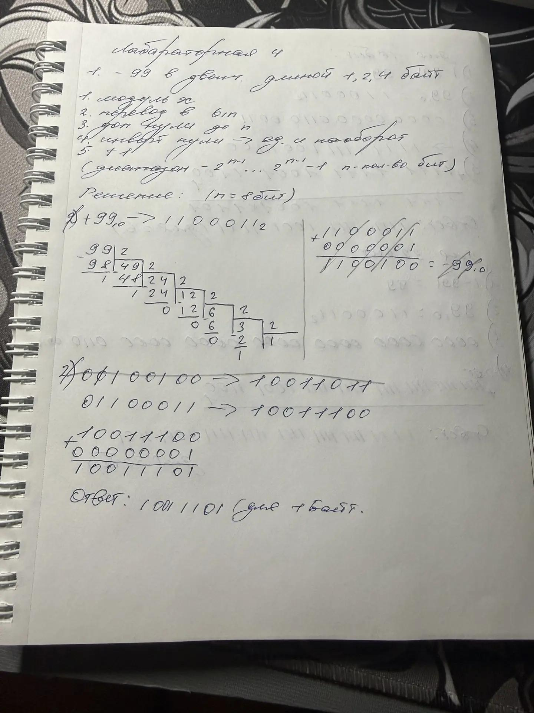
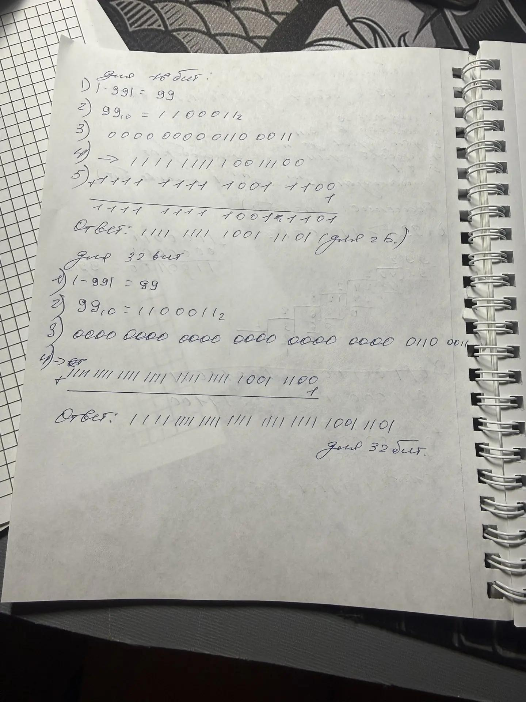
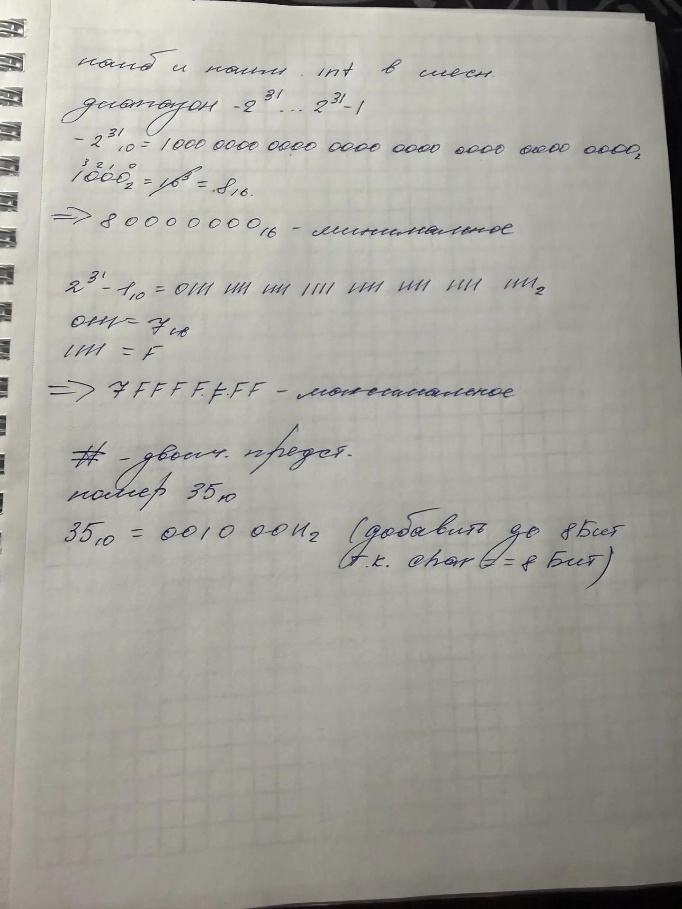
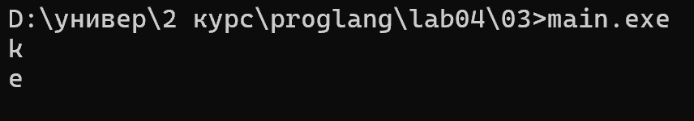
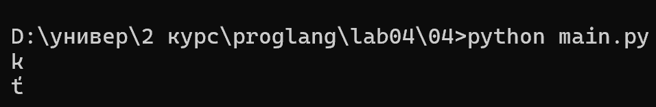
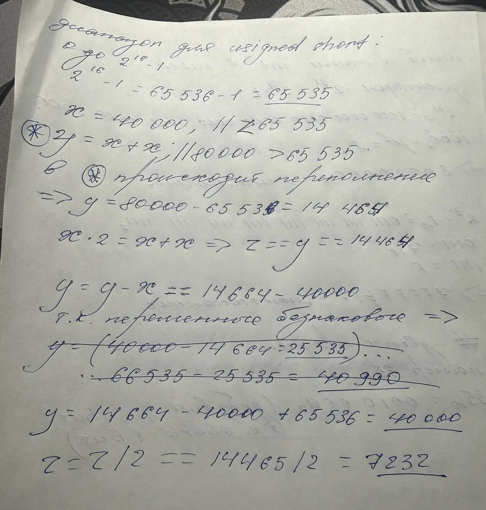
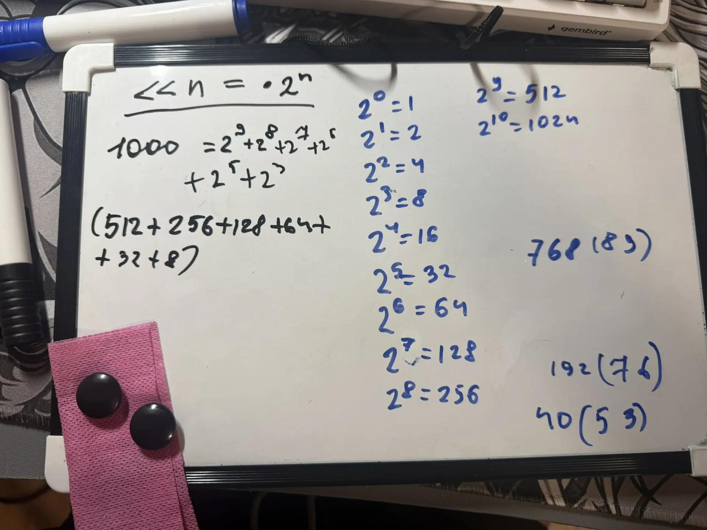

# Языки программирования
## Лабораторная работа 4

### Задание 1 **(3)**
* *Запишите двоичное представление числа -99 в целочисленном знаковом типе длиной 1, 2, 4 байта.* 
* *Запишите литералы равные наибольшему и наименьшему числу в типе* **int** *в шестнадцатеричной записи.*
* *Запишите двоичное представление символа "`#`" в типе* **char**.


решение сделал полностью в тетради:





### Задание 2 **(3)**
*Напишите пример программы на С++ с использованием целочисленных литералов в разных форматах записи, 
разной длины, знаковых и беззнаковых. 
Пример должен охватывать большинство способов записи целочисленных литералов.*

написал программу на с++ с разными вариациями переменных(см. main.cpp) при выполнении получил значения в десятичном представлении это показывает важную вещь: система записи литерала влияет на то, как число записывается в коде, но само числовое значение остаётся тем же

### Задание 3 **(2)**
*Объясните работу фрагмента программы на С++. В ходе объяснения следует использовать таблицу кодов символов.*
```
char a = 'a';  // a == 'a'     
a = a + 10;     // a == 'k'
std::cout << a << std::endl;
a = a + 250;
std::cout << a;    // a == 'e'
```
выполнив программу получим:

Изначально переменная `a` имеет значение символа 'a' с номером в таблице символов 97 после чего к переменной(тип char) прибавляется целое число к номеру переменной и получаем символ с номером 107('k')
аналогично с `а + 250` (107+250 = 257) 
Но char занимает 1 байт = 8 бит. 
8 бит могут представить 256 различных значений
Поэтому при таком преобразовании остаётся значение по модулю 256: 357 - 256 = 101
101 → 'e' (по номеру в таблице)

### Задание 4 **(2)**

*Перепишите программу из предыдущего задания на Python, используя функции* **chr** и **ord**.
*Почему ее вывод отличается от вывода программы на С++?*

выполнив программу на пайтон получил:


результат отличается в C++ char — это 8-битный тип, а в Python int не ограничен 8 битами поэтому переполнение с 256 работает по другому


### Задание 5. **(2)**

*Объясните работу фрагмента программы на С++. В частности, почему* $x+x-x=x$, *но при этом*
$(x\cdot 2)/2\neq x$? *В отчете надо привести вычисления, приводящие к ответу.*
```
unsigned short x = 40000; // 40000
unsigned short y = x + x;   // 14465
unsigned short z = x * 2;     //14465
y = y - x; //40000
z = z / 2;    //7232
std::cout << y << " " << z << std::endl;
```

стоит обратить внимание на диапазон `unsigned short` от 0 до 2^16 - 1
вычисления буду делать в тетради:




### Задание 6 **(2)**

*Объясните работу фрагмента программы на С++. Если имеет место переполнение, 
то требуется найти точный ответ до запуска программы, а только потом сверить его с выводом.
В отчете надо привести вычисления, приводящие к ответу.*
```
std::cout << 2000000000 + 1000000000 << std::endl;
std::cout << 2000000000U + 1000000000U << std::endl;
std::cout << 2500000000U + 2500000000U << std::endl;
std::cout << 2500000000LL + 2500000000LL << std::endl;
std::cout << 20000U * 200000U << std::endl;
std::cout << 200000U * 200000U << std::endl;
```

В программе рассматриваются особенности вычислений с целочисленными литералами разных типов.

В выражении

2000000000 + 1000000000

оба литерала имеют тип int. Их сумма равна:

2000000000 + 1000000000 = 3000000000

Полученное значение превышает максимальное значение знакового int (2147483647), поэтому происходит переполнение.

В выражении
2000000000U + 1000000000U

литералы имеют тип unsigned int. Максимальное значение unsigned int равно 4294967295, поэтому сумма 3000000000 помещается в этот тип. Переполнения нет.

В выражении
2500000000U + 2500000000U

сумма равна:

2500000000 + 2500000000 = 5000000000

Это больше максимального значения unsigned int, поэтому происходит переполнение по модулю 2^32:

5000000000 - 4294967296 = 705032704

В выражении
25000000000LL + 25000000000LL

используется суффикс LL, поэтому литералы имеют тип long long. Сумма равна:

25000000000 + 25000000000 = 50000000000

Это значение помещается в long long, поэтому переполнения не происходит.

В выражении
20000U * 200000U

оба литерала имеют тип unsigned int. Результат:

20000 * 200000 = 4000000000

Это значение находится в диапазоне unsigned int, поэтому переполнения нет.

В выражении
200000U * 200000U

результат равен:

200000 * 200000 = 40000000000

Полученное значение превышает максимальное значение unsigned int, поэтому происходит переполнение по модулю 2^32:

40000000000 % 4294967296 = 1345294336


### Задание 7 **(2)**


*Напишите программу на Python умножающую введенное число на 1000. В программе 
можно использовать только операторы сдвига и сложения. Циклы использовать нельзя. Из функций
можно использовать только* **input** *и* **print** *для ввода и вывода.*
```
x = int(input())
y = ...
print(y)
```
для умножения на 1000 путем сдвига нужно представить 1000 как степень двойки т.к. сдвиг на n == умножению на 2^n

я представил 1000 как сумму 2 со степенями 9, 8, 7, 6, 5, 3:


(программа в папке 07)

### Задание 8 **(2)**

*Найдите результаты вычисления следующих выражений без использования компьютера
или калькулятора. Процесс вычислений должен быть отображен в отчете.*
* `(1000 & 100) << 10`
* `(1000 >> 4) & 15`
* `~1234 + 1234`
* `(1000 ^ 500) & 63`
* `(100 << 3) + (100 >> 3)`

* & — побитовое И сравнивает числа по каждому биту. Оставляются только те позиции, где оба бита равны 1.
* ^ — побитовое исключающее ИЛИ 1 получается, когда биты разные.
* << — сдвиг влево:(x << n) = (x * 2^n)
* >> — сдвиг вправо: (x >> n) = (x/2^n) (деление на 2 с отбрасыванием дробной части)
* ~ — побитовое НЕ инвертирует каждый бит ~x = -x-1

1 `(1000 & 100) << 10`

Переведём числа в двоичную систему:

text
1000 = 1111101000
100  = 0001100100

Выполняем побитовое И:

  1111101000
& 0001100100
------------
  0001100000

Получаем:

0001100000 = 96

Теперь сдвигаем влево на 10 позиций:

96 << 10 = 96 · 2^10
         = 96 · 1024
         = 98304

Ответ: 98304

2. (1000 >> 4) & 15

Сначала выполняем сдвиг вправо на 4 позиции:

1000 = 1111101000

1111101000 >> 4 = 00111110

Получаем:

00111110 = 62

Теперь:

15 = 00001111

Выполняем &:

  00111110
& 00001111
----------
  00001110
00001110 = 14

Ответ: 14

3. ~1234 + 1234

Для побитового НЕ используется правило:

~x = -x - 1

Поэтому:

~1234 = -1234 - 1
      = -1235

Теперь прибавляем 1234:

-1235 + 1234 = -1

Ответ: -1

4. (1000 ^ 500) & 63

Переведём числа в двоичную систему:

1000 = 1111101000
500  = 0111110100

Выполняем побитовое исключающее ИЛИ (^):

  1111101000
^ 0111110100
------------
  1000011100

Получаем:

1000011100 = 540

Теперь переводим 63 в двоичную систему:

63 = 00111111

Выполняем &:

  1000011100
& 0000111111
------------
  0000011100

Получаем:

0000011100 = 28

Ответ: 28

5. (100 << 3) + (100 >> 3)

Сначала выполняем левый сдвиг:

100 << 3 = 100 · 2
         = 100 · 8
         = 800

Теперь выполняем правый сдвиг:

100 >> 3 = 100 / 2
         = 100 / 8
         = 12

Так как число целое, дробная часть отбрасывается.

Теперь складываем:

800 + 12 = 812

Ответ: 812

###  Задание 9 **(2)**
*Напишите программу на языке С++ для умножения заданного целого числа на* $-1$. *В программе можно использовать только сложение и битовые
операции. Условия, циклы, библиотечные функции использовать нельзя.*

программа в папке 09

## Дополнительные задания

### Задание 1 **(3)**

*Какие значения можно присвоить целочисленной переменной* **x**,
*чтобы результатом выражения `x|(x+1)` стало число 895?
Найдите все значения без использования компьютерных вычислений. 
Обоснуйте ответ.*

### Задание 2 **(3)**

*Какие значения можно присвоить целочисленной переменной* **x**,
*чтобы результатом выражения `x&(x-1)` стало число 0?
Найдите все значения без использования компьютерных вычислений 
(среди них есть отрицательные числа). Обоснуйте ответ.*

### Задание 3 **(3)**
*Какие значения можно присвоить целочисленной переменной* **x**,
*чтобы результатом выражения `x|(2*x)` стало число 1975?
Найдите все значения без использования компьютерных вычислений. 
Обоснуйте ответ.*

### Задание 4 **(3)**
*Обоснуйте корректность работы программы "Разложение числа по степеням двойки" из лекции.
Требуется определить, что будет результатом выражения `x&-x`.*

### Задание 5 **(5)**
*Ответьте на вопросы по программе "Упаковка коротких чисел" из лекции.*

* *Можно ли указанным способом сохранить более 8 чисел? Обоснуйте ответ.*
* *Сколько чисел можно будет сохранить при изменении диапазона от 0 до 7? Обоснуйте ответ.*
* *В чем смысл <<магической>> константы 15 в тексте программы?*
* *Если по условию задачи надо будет сохранить только числа в интервале от 0 до 10, то следует ли заменить
эту константу на 10? Обоснуйте ответ.*

### Задание 6 **(3)**
*Рассмотрим следующую программу на языке Python. Сколько чисел она выводит в зависимости от введенного
значения* **x**? *Как полученные числа зависят от* **x**?
```
x = int(input())
i = x
while i>0:
   print(i)
   i = (i-1) & x
```
